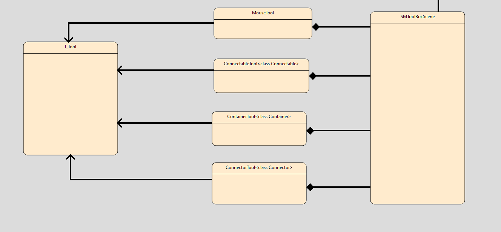

# MeMoTo

MeMoTo for MErgeable MOdeling TOol is yet another modeling tool focused on DevOps issues.

Please note that this program is in it's early development stages and has flows and issues. My opinion is that it's already usable in production by a dev team but the team has to be trained.

## Principles

- Text file based, readable and writable from text editors to solve conflicts and understand diffs in a pull request.
- Simple GUI: I didn't want one of those modeling tools leaving you a quarter of your screen to see what you draw.
- Pluggable: Json files are saved, read it with a code generator? Easy.
- LightWeight: C++ over Qt for cross platform code
- No project file: Link between diagrams are made with environment variables, no project file to easily integrate to CI/CD

## Use case

Let's assume you are developing a critical/complex system and need code to be generated from design. Design should not be different than code and should be manageable through branches and pull requests.

## How to use it

### Simple GUI comes with a few shortcuts to know:

- left click to select, right click to perform action
- Switch between diagrams with ctrl+tab
- Switch between tools with F1, F2 etc...
- Save with ctrl+s
- Save as with ctrl+shift+s
- load with ctrl+o
- undo with ctrl+z
- redo with ctrl+shift+z
- Copy/paste with ctrl+c and ctrl+v
- share with ctrl+space
- find into diagram with ctrl+f
- print to png with ctrl+p

### MeMoTo can also be run with commands

- --help
- --version
- --output-png (headless print png from diagram and close)
- --default-diagram (since a class can have multiple diagram types, opens MeMoTo on the desired diagram)
- --focus-on (searchs for the first occurence of the given value and opens MeMoTo to quickly find something)

Note: The sharing feature is a bit wierd. It relies on a common network repository and uses a sqlite file. Choose a network volume to put the sharing file on it and give the full network path to your coworkers.

# How to add a diagram type

- See doc/MeMoTo.memoto
- You can use the QtCreator project file or use cmake directly
- This project uses Qt6 framework
- You need to implement I_DiagramContainer
- You need to be composed of a toolbox, itself implementing I_ToolBox
- Check SMDiagramScene and SMToolBoxScene for an example
- You can create your tools and items implementing I_Tool and the item type you want
- Plug your diagram into MainWindow::initDiagrams() method, you're good to go!

# What is planed

- Usability: png generation path asking
- Aesthetic: curved connections, rounded items

